# Invoice-Managment-System

## About app
Invoice Managment System is a web app that proivde simple system to manage company resaurces and invoices. It allows to add another moderator users and perform various actions on database records.

## Features

- Login:  
  

- Register:  
  

- Watch stats  
  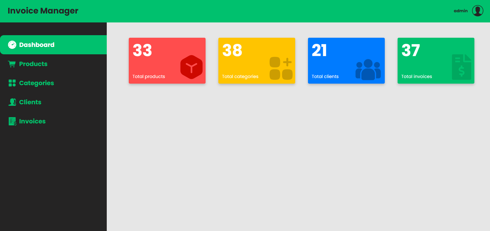

- Browse, filter records  
  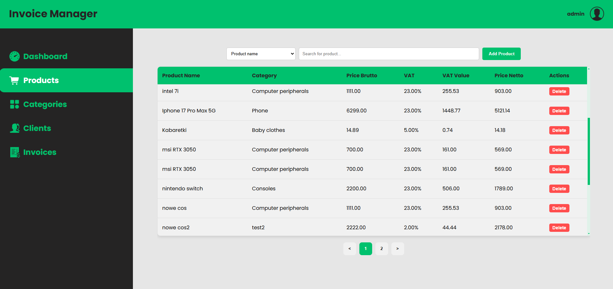

- Add, edit, remove records  
  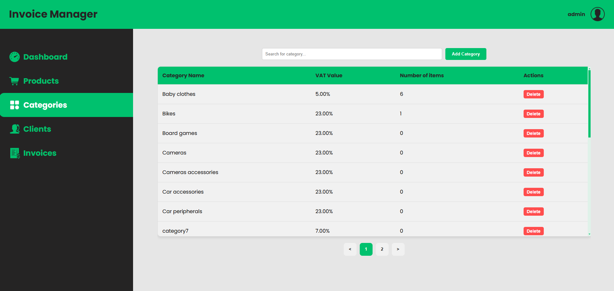

- Generate PDF files  
  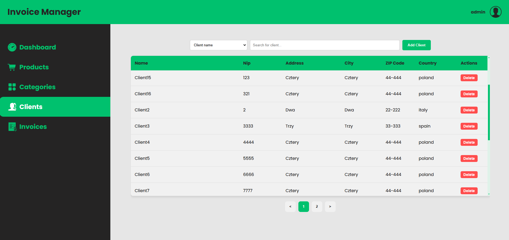

- Share access  
  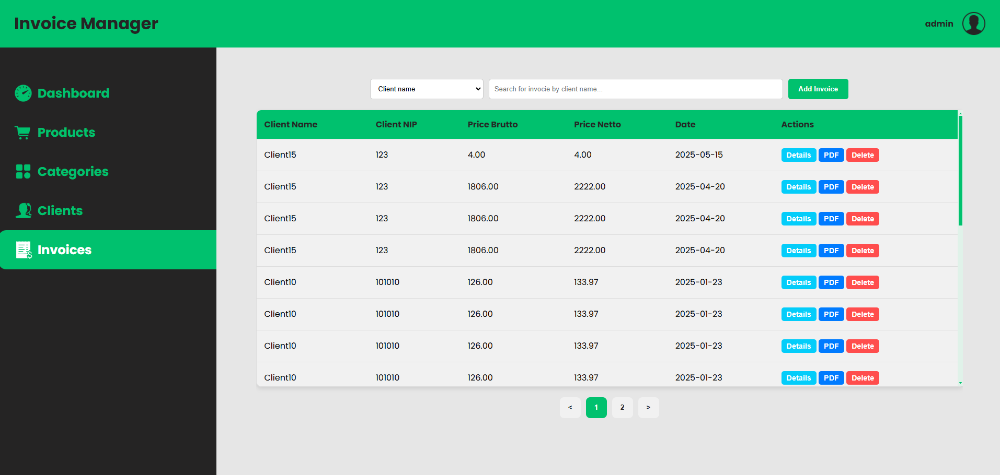

- Add, remove records  
  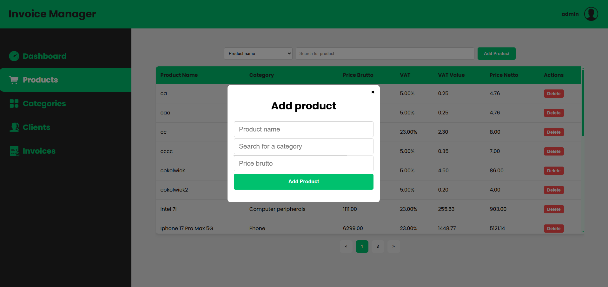

  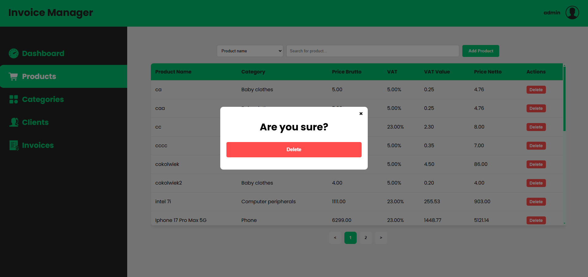

  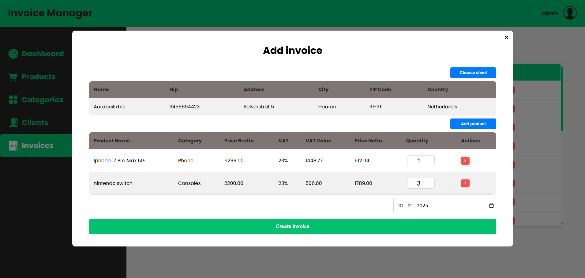

- Generate PDF files  
  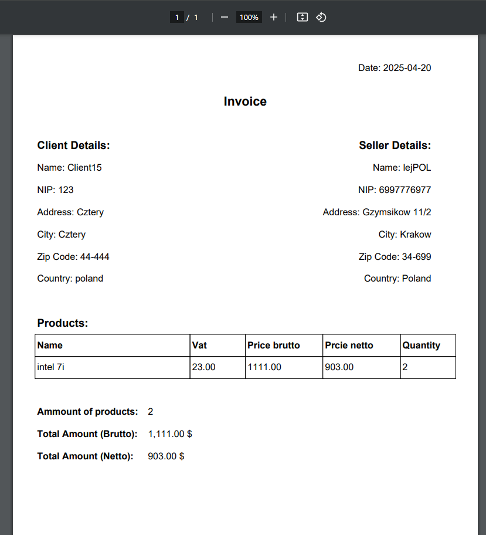

- Share access with other users to manage the company  
  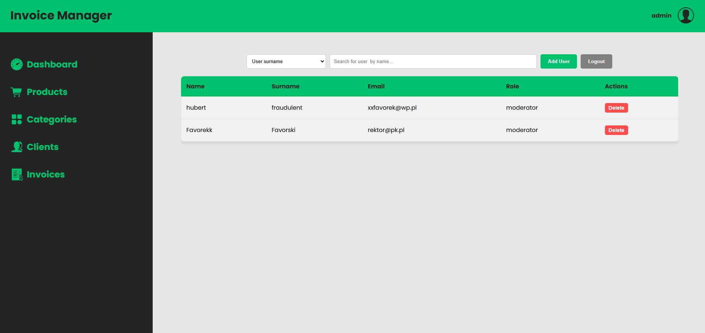

- App requires docker and docker compose to launch

- Clone repository 

```
https://github.com/HubertChruscicki/Invoice-Managment-System.git
docker-compose up -d

```
- Bulid and start containers
```
docker-compose up -d

```
- Create database by executing in query console file `databaseCreate.sql`
- Type in browser 
```
http://localhost:8000

```
## Database uml
 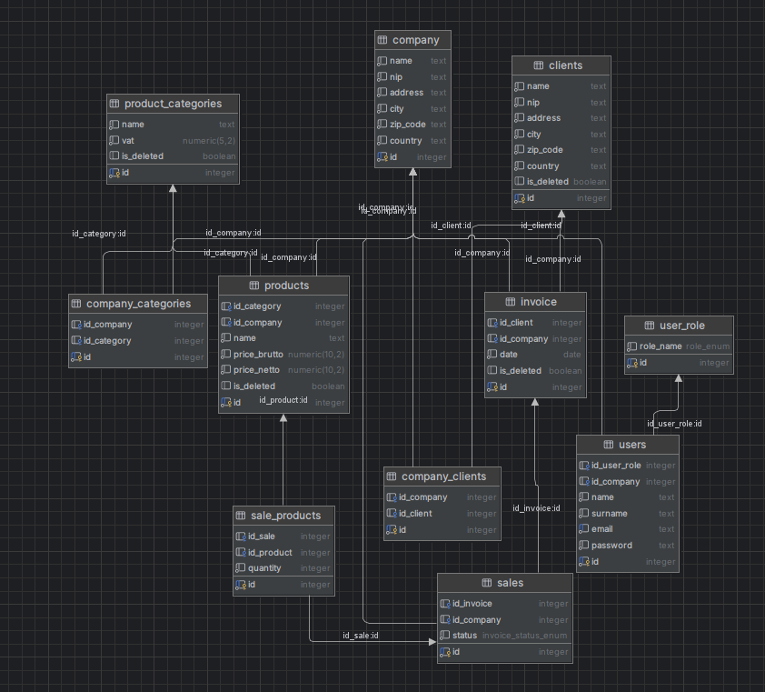


## File structure

- `PHP files` mainly views
- `Repositories files` represents data structures and actions on database.
- `Controllers files` Perform various tasks with records and contain backend logic
- `JS files` Stands for frontend: fetching data, rendering html, css properly in real time due to needs
- `CSS files` Styles app
- `Other files` DATABASE.php for database configuration,
index.php as the application entry point,
Routing.php for handling routes.
